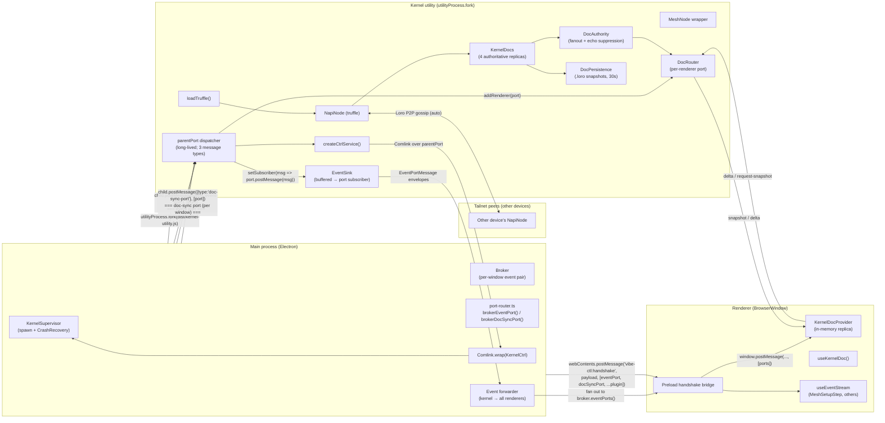
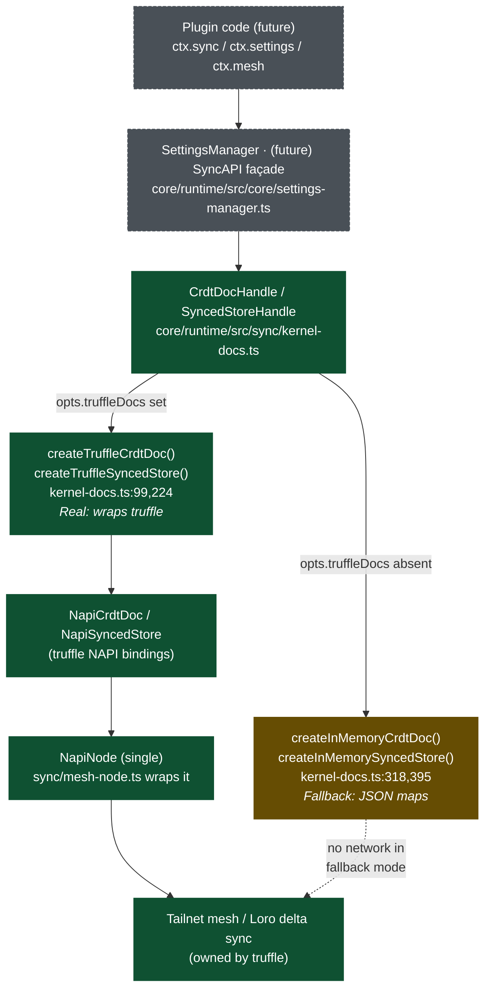
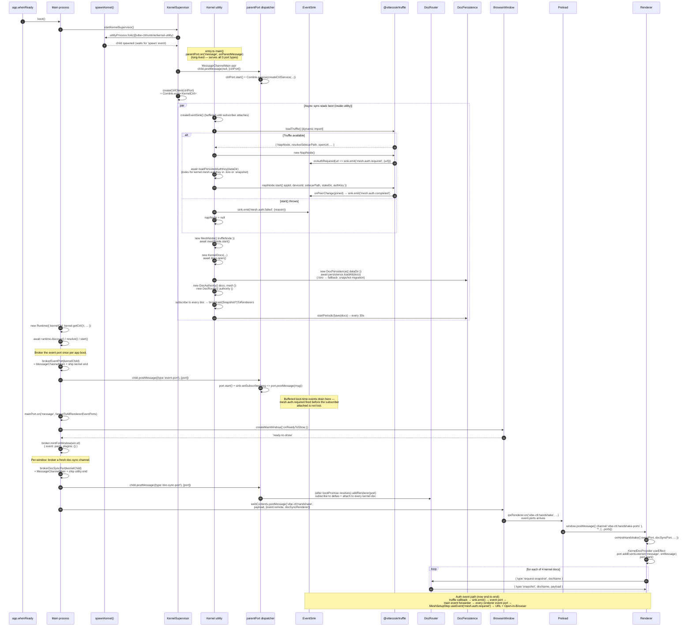
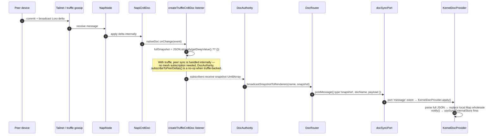
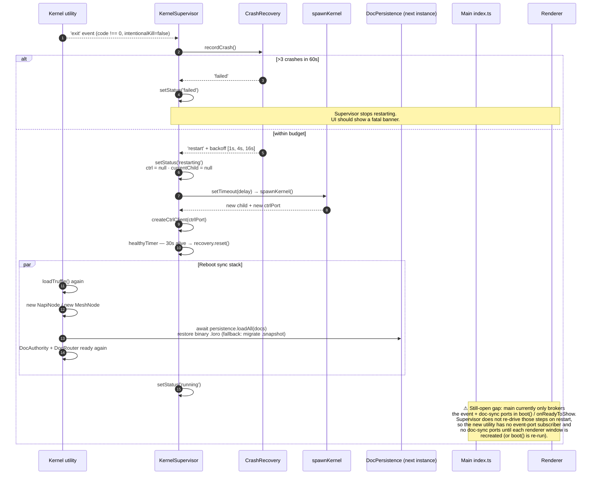

# Truffle wiring

Comprehensive map of how `@vibecook/truffle` is integrated into vibe-ctl.

- **Documented at**: commit `858d7df` (`fix(runtime): route kernel events
  via dedicated MessagePort + link truffle wrapper`).
- **Truffle status**: optional runtime dependency. Compile-time, the
  runtime uses local structural interfaces in
  `core/runtime/src/sync/truffle-types.ts` so it type-checks whether or
  not the package resolves. At runtime the kernel utility calls
  `loadTruffle()` (dynamic `import('@vibecook/truffle')`); if the binary
  binding is missing, every doc falls back to an **in-memory simulation**.
- **Local iteration**: `.pnpmfile.cjs` now rewrites `@vibecook/truffle` →
  `link:../p008/truffle/packages/core` when `VIBE_LINK_LOCAL=1` is set at
  install time. **This is the high-level wrapper** that re-exports the
  NAPI crate and adds `resolveSidecarPath()` + `openUrl()` + the
  `createMeshNode` helpers. Previously the link pointed at
  `crates/truffle-napi` (the low-level NAPI binding) which lacked those
  helpers — `entry.ts` would throw at boot on
  `truffle.resolveSidecarPath is not a function`. Otherwise it resolves
  from the registry as `^0.4.2`.

Declared consumers (from `package.json`):
- `core/plugin-api` (peer, marked optional)
- `core/runtime` (dep — owns the NapiNode and all adapters)
- `core/canvas` (dep)
- `plugins/terminal`, `plugins/claude-code`, `plugins/notifications`,
  `plugins/dynamic-island` (deps — truffle is also listed in the top-level
  `"external"` array in the root `package.json` so bundlers never
  pull it into plugin dist artifacts; it is always host-provided).

> **Status**: the renderer ↔ kernel-utility doc-sync fabric and the
> kernel-utility → renderer event stream are **now fully wired**.
> DocRouter is instantiated, doc-sync ports are brokered per-window,
> and `mesh.auth.required` / `.completed` / `.failed` events flow end
> to end via a dedicated event MessagePort (not Comlink). The only
> remaining efficiency gap is "Truffle onChange carries no binary delta";
> see "Known gaps" at the bottom for the snapshot-per-change mitigation.

---

## Recent fixes

Chronological summary of the 10 commits between `9b2c0a0` (the previous
revision of this doc) and `858d7df` (current HEAD):

| Commit | One-line |
|---|---|
| `ae3a3e9` | `TruffleModule` interface gains `resolveSidecarPath()` + `openUrl(url)`; loader cast to `unknown` for safety. |
| `dcd8edf` | Kernel utility parentPort listener is now long-lived and dispatches 3 message types; `DocRouter` is instantiated. |
| `5590fe8` | Main brokers a fresh doc-sync port per renderer window via `brokerDocSyncPort(kernelChild)` on `ready-to-show`. |
| `786f169` | Loro delta capture falls back to full-snapshot-per-change (`JSON.stringify(getDeepValue())`) because NAPI lacks `export()` / `exportFromFrontier()` / `version()`. |
| `5de6931` | Persistence writes real `.loro` binary snapshots with a one-shot migration path from the legacy `.snapshot` JSON files. |
| `d0ac3e2` | New VibeEvents: `mesh.auth.required`, `mesh.auth.completed`, `mesh.auth.failed`. |
| `73b9f8e` | Kernel utility emits `mesh.auth.required` on truffle's `onAuthRequired` callback. |
| `4c8df2e` | Kernel utility emits `mesh.auth.completed` on first peer join (once per process lifetime). |
| `7067db2` | `authKey` read from `kernel/user-settings` (best-effort pre-start file read) enables headless Tailscale auth. |
| `79f73db` | `MeshSetupStep` onboarding UI subscribes to the three mesh-auth events and shows the Tailscale URL + Open-in-Browser button. |
| `858d7df` | Events now flow through a dedicated `MessagePortMain` pair, not a Comlink.proxy callback — the ctrl channel cannot transfer Web `MessagePort`s that `Comlink.proxy` mints internally. `onEvent` removed from `KernelCtrl`. |

---

## 1. Process topology

Three OS processes participate. Truffle lives exclusively in the kernel
utility; the main process only brokers MessagePorts, and the renderer only
holds eventually-consistent JSON mirrors of each doc. Three distinct
channels run between main and the kernel utility: **ctrl** (Comlink),
**event** (raw MessagePort), and **doc-sync** (one per renderer window).



- **Authoritative NapiNode**: exactly one, in the kernel utility
  (`entry.ts:130` — `new truffle.NapiNode()`). Spec 02 §11.1 invariant.
- **Authoritative CrdtDoc replicas**: in the kernel utility
  (`KernelDocs.open()`, `kernel-docs.ts:507`).
- **Renderer replicas**: non-authoritative JSON mirrors driven off the
  doc-sync port. Truffle-backed docs arrive as `type: 'snapshot'` (full
  state) on every change; in-memory fallback docs arrive as
  `type: 'delta'`.
- **MessagePorts** (all `MessagePortMain` pairs in main-side code):
  - **ctrl port** — Comlink client (main) ↔ ctrl service (utility).
    Minted in `spawn.ts`, transferred via `child.postMessage(null, [port])`
    as the utility's first parentPort message.
  - **event port** — raw `MessagePortMain` pair. Minted by
    `brokerEventPort(kernelChild)` in `core/shell/src/main/kernel/port-router.ts`.
    Kernel end shipped as `{type:'event-port'}`; main end retained in
    `core/shell/src/main/index.ts` where an `on('message')` listener
    fans out to every tracked `broker.eventPorts()`.
  - **doc-sync port (one per renderer window)** — minted by
    `brokerDocSyncPort(kernelChild)` on `ready-to-show`. Utility end
    shipped as `{type:'doc-sync-port'}`; renderer end included in the
    handshake payload after `event.remote`.

---

## 2. Layer stack

Top-down view of what layer a consumer sees and what sits under it.



Every rectangle lives in the **kernel utility process**. The only
exception is the (future) plugin code, which — depending on trust tier —
runs in-process (T1/T2 plugin worker) or in a split plugin utility
(T3 plus permissioned T2); it reaches truffle via `ctx.*` RPC.

Layer ownership summary:

| Layer | Owns | Process | Real or stub |
|---|---|---|---|
| Plugin code | — | plugin worker / split-plugin | future |
| SettingsManager | `core/runtime/src/core/settings-manager.ts` | kernel utility | real (kernel-docs backed) |
| `CrdtDocHandle` / `SyncedStoreHandle` | `core/runtime/src/sync/kernel-docs.ts` | kernel utility | real interface; two impls |
| Truffle adapter | `kernel-docs.ts:99` (`createTruffleCrdtDoc`) | kernel utility | real when truffle loads |
| In-memory fallback | `kernel-docs.ts:318`, `:395` | kernel utility | stub (JSON simulation) |
| `NapiCrdtDoc` / `NapiSyncedStore` | `@vibecook/truffle` | kernel utility | native (Rust + Loro) |
| `NapiNode` | `@vibecook/truffle` | kernel utility | native (Rust) |
| Mesh network | Tailscale-derived + Loro gossip | external | native |

---

## 3. Startup sequence



Files referenced:
- Main boot: `core/shell/src/main/index.ts:59`
- Event broker + forwarder: `core/shell/src/main/index.ts:108` (calls
  `brokerEventPort` and wires the `on('message')` fanout).
- Port router: `core/shell/src/main/kernel/port-router.ts` (both
  `brokerEventPort` and `brokerDocSyncPort`).
- Spawn: `core/shell/src/main/kernel/spawn.ts`
- Supervisor: `core/shell/src/main/kernel/supervisor.ts`
- Kernel utility entry + sync-stack boot:
  `core/runtime/src/kernel-utility/entry.ts:111`
- parentPort dispatcher: `core/runtime/src/kernel-utility/entry.ts:394`
- EventSink: `core/runtime/src/kernel-utility/event-sink.ts`
- DocRouter: `core/runtime/src/kernel-utility/doc-router.ts`
- Ctrl service: `core/runtime/src/kernel-utility/ctrl-service.ts`
- Handshake delivery: `core/shell/src/main/ipc/handshake.ts`
- Preload re-post: `core/shell/src/preload/handshake.ts`
- Renderer pickup: `core/shell/src/renderer/host/KernelDocProvider.tsx`

---

## 4a. Local-edit delta flow (renderer → authority → world)

```mermaid
sequenceDiagram
  autonumber
  participant UI as Renderer UI
  participant Store as KernelDocStore (renderer)
  participant Port as docSyncPort (MessagePort)
  participant Router as DocRouter
  participant Auth as DocAuthority
  participant Doc as KernelDocs.getDoc(name)
  participant Truffle as NapiCrdtDoc
  participant Peer as Peer device

  UI->>Store: doc.data.set(key, value) (optimistic)
  UI->>Port: port.postMessage({ type:'delta', docName, payload: JSON })
  Port->>Router: 'message' listener in DocRouter.addRenderer
  Router->>Auth: authority.applyDelta(name, payload, sourcePort)
  Auth->>Doc: doc.applyDelta(payload)
  Doc->>Truffle: mapInsert(ROOT_MAP, key, value); commit()
  Truffle-->>Peer: Loro delta gossip (automatic)

  Note over Truffle,Auth: commit() → truffle onChange fires → adapter emits<br/>a FULL SNAPSHOT (JSON of getDeepValue()) because<br/>NAPI has no export()/exportFromFrontier()/version().
  Truffle->>Auth: onChange → subscribers receive Uint8Array(snapshot)
  Auth->>Auth: docs.isTruffleBacked ? broadcastSnapshotToRenderers : broadcastToRenderers
  Auth-->>Port: for each renderer port: postMessage({type:'snapshot', docName, payload})
  Note over Port: Source-port echo suppression still applies —<br/>the source is excluded from the fanout.
  Auth->>Auth: notify internal delta listeners (persistence markDirty)
```

## 4b. Peer-edit delta flow (peer → authority → renderers)



**Why snapshot-per-change?** Truffle's `NapiCrdtDoc` (the NAPI binding)
exposes only `mapInsert / mapDelete / commit / getDeepValue / onChange`.
It does **not** expose `export()`, `exportFromFrontier()`, or `version()`,
so there is no way to capture a Loro binary delta between two commits at
this layer. The adapter in `kernel-docs.ts:113` resolves this by emitting
the full current state on every change (`JSON.stringify(getDeepValue())`)
and routing it through `DocAuthority.broadcastSnapshotToRenderers`, which
publishes `type: 'snapshot'` messages. Renderers wholesale-replace their
replica — correct but expensive for large docs. Fixing this cleanly
requires an upstream change in truffle's NAPI surface.

In fallback (no-truffle) mode the peer path is:

`peerSocket → Mesh.subscribe('doc:${name}') → DocAuthority.applyDelta → doc.applyDelta → broadcastToRenderers` (authority.ts:176) — still emitted as `type: 'delta'`.

---

## 5. Crash recovery



On restart, the new kernel utility is a fresh process:
the old ctrl, event, and doc-sync ports are closed. Main would need to
re-broker **all three** — ctrl (automatic via supervisor), event
(via `brokerEventPort`), and one doc-sync port per active renderer
window (via `brokerDocSyncPort`). Spec 05 §6.4 requires this; see "Known
gaps" for the still-open ticket.

Files:
- Supervisor: `core/shell/src/main/kernel/supervisor.ts:86` (`spawnAndWire`).
- CrashRecovery: exported from `@vibe-ctl/runtime`.
- Snapshot restore: `core/runtime/src/kernel-utility/persistence.ts:82`.

---

## 6. Key files

| File | Process | Role | Real / Stub |
|---|---|---|---|
| `core/runtime/src/sync/truffle-types.ts` | — (types + dynamic import) | Compile-safe structural types; `TruffleModule` now declares `resolveSidecarPath(): string` and `openUrl(url: string): void` | Real + stub boundary |
| `core/runtime/src/sync/mesh-node.ts` | kernel utility | Wraps `TruffleNapiNode`; no-op when `truffleNode` absent | Adapter (real when truffle present) |
| `core/runtime/src/sync/kernel-docs.ts` | kernel utility | Defines `CrdtDocHandle` / `SyncedStoreHandle`; truffle adapter emits **full-state JSON** on every commit (NAPI lacks binary export) | Adapter + fallback |
| `core/runtime/src/sync/doc-authority.ts` | kernel utility | Per-doc fanout; now has both `broadcastToRenderers` (delta) and `broadcastSnapshotToRenderers` (truffle path) | Real |
| `core/runtime/src/sync/offline-mode.ts` | kernel utility | Per-policy gating (known gap: wired into debug UI only) | Real |
| `core/runtime/src/sync/version-beacons.ts` | kernel utility | Per-device version slice (uses local fallback store) | Stub backing |
| `core/runtime/src/kernel-utility/entry.ts` | kernel utility | Boot orchestrator; long-lived parentPort dispatcher (3 message types); emits auth events via EventSink | Real |
| `core/runtime/src/kernel-utility/ctrl-service.ts` | kernel utility | Comlink service. **`onEvent` removed** — events flow via the dedicated event port, not Comlink | Real |
| `core/runtime/src/kernel-utility/event-sink.ts` | kernel utility | Buffered event stream; `setSubscriber(cb)` attaches the "post to event port" callback when `{type:'event-port'}` arrives | Real (now connected) |
| `core/runtime/src/kernel-utility/doc-router.ts` | kernel utility | Per-port listener, snapshot response, delta apply. **Now instantiated** in `bootSyncStack()` | Real (wired) |
| `core/runtime/src/kernel-utility/persistence.ts` | kernel utility | `.loro` binary snapshots at `{dataDir}/truffle/{name}.loro`, 30s cadence, migrates legacy `.snapshot` on load | Real (binary; opaque payload) |
| `core/runtime/src/kernel-utility/shutdown.ts` | kernel utility | SIGTERM + `{type:'shutdown'}` hook | Real |
| `core/runtime/src/ipc/kernel-ctrl.ts` | types | `KernelCtrl` Comlink interface (`getVersion`, `getPeers`, `health`, `start`, `stop`). `KernelEventCallback` type is **for internal EventSink use only** — not on the Comlink surface | Real |
| `core/runtime/src/ipc/events.ts` | types | `EventPortMessage` envelope — `{type, payload}` keyed by `VibeEvents` | Real |
| `core/runtime/src/ipc/doc-sync.ts` | types | `DocSyncMessage` shape (`snapshot` \| `delta` \| `request-snapshot`) | Real |
| `core/runtime/src/ipc/handshake.ts` | types | `HandshakeChannel`, payload (`deviceId`, `deviceName`, `kernelVersion`, `pluginRpcOrder`) | Real |
| `core/runtime/src/ipc/comlink-node-adapter.ts` | both sides | `nodeEndpoint()` adapter for Comlink over `MessagePortMain` | Real |
| `core/plugin-api/src/events.ts` | types | VibeEvents catalog now includes `mesh.auth.required` / `.completed` / `.failed` | Real |
| `core/shell/src/main/index.ts` | main | Boot sequence; calls `brokerEventPort(kernelChild)` once at boot and `brokerDocSyncPort(kernelChild)` per window; fans event-port messages to every `broker.eventPorts()` | Real |
| `core/shell/src/main/kernel/spawn.ts` | main | `utilityProcess.fork` + ctrl port transfer | Real |
| `core/shell/src/main/kernel/supervisor.ts` | main | Crash recovery (1s/4s/16s backoff, 3 in 60s); exposes `getChild()` so `main/index.ts` can broker ports | Real |
| `core/shell/src/main/kernel/ctrl-client.ts` | main | `Comlink.wrap<KernelCtrl>` | Real |
| `core/shell/src/main/kernel/port-router.ts` | main | **`brokerEventPort(kernelChild)`** (new) mints event-port pair; **`brokerDocSyncPort(kernelChild)`** mints per-window doc-sync pair; both ship kernel-side via `child.postMessage({type:...}, [port])` | Real (both used) |
| `core/shell/src/main/ipc/broker.ts` | main | Per-window event pair; `eventPorts()` returns all event.local ports for fanout. Doc-sync pairs are NOT tracked here — they're brokered directly into the kernel utility | Real |
| `core/shell/src/main/ipc/handshake.ts` | main | Delivers ports via `webContents.postMessage`; order is `[event.remote, docSyncRenderer, ...plugins]` | Real |
| `core/shell/src/preload/handshake.ts` | preload | Re-posts ports to window main world | Real |
| `core/shell/src/renderer/host/KernelDocProvider.tsx` | renderer | In-memory JSON replica; consumes snapshots + deltas. Truffle-backed docs arrive as snapshot-on-every-change | Real |
| `core/shell/src/renderer/host/useKernelDoc.ts` | renderer | `useSyncExternalStore` hook | Real |
| `core/shell/src/renderer/host/useEventStream.ts` | renderer | `useEvent(type, cb)` hook over the event port | Real |
| `core/shell/src/renderer/screens/onboarding/steps/MeshSetupStep.tsx` | renderer | Subscribes to the three mesh-auth events; renders the Tailscale URL + Open-in-Browser button; uses `system.openExternal` bridge invoke | Real (WIP; uncommitted in working tree) |
| `core/shell/src/renderer/screens/debug/SyncDebugScreen.tsx` | renderer | Dev harness — 7 sections + validation | Real (offline only today) |
| `core/shell/src/renderer/screens/debug/validation.ts` | renderer | 6 local round-trip checks | Real |
| `.pnpmfile.cjs` | toolchain | Opt-in `link:` rewrite under `VIBE_LINK_LOCAL=1`. **Now points at `../p008/truffle/packages/core`** (the high-level wrapper with `resolveSidecarPath`), not the low-level `crates/truffle-napi` | Real |

---

## 7. Auth event flow (new, end-to-end)

Now that events + headless authKey + UI are all wired, the full path
from "user first launches the app without Tailscale" through to
"connected" looks like this:

```mermaid
sequenceDiagram
  autonumber
  participant User
  participant UI as MeshSetupStep (renderer)
  participant EP as renderer event port
  participant Main as Main event forwarder
  participant MP as main event port (kernel end)
  participant Sink as EventSink (utility)
  participant Node as NapiNode (truffle)
  participant TS as Tailscale sidecar

  User->>UI: reach MeshSetupStep in onboarding
  Note over Sink,Node: NapiNode.start() runs in the utility;<br/>truffle calls onAuthRequired(url) when the tailnet<br/>login URL is ready.
  Node->>Sink: sink.emit('mesh.auth.required', {url})
  Sink->>MP: port.postMessage({type:'mesh.auth.required', payload:{url}})
  MP->>Main: mainPort 'message' event
  Main->>EP: for each broker.eventPorts(): postMessage(msg)
  EP->>UI: useEvent('mesh.auth.required', payload => setUrl(...))
  UI->>User: show URL + Copy + "Open in Browser" button
  User->>UI: click Open in Browser
  UI->>Main: bridge.invoke('system.openExternal', {url})
  Main->>TS: shell.openExternal(url) → browser opens tailnet login
  User->>TS: approve device
  TS-->>Node: peer joined
  Node->>Sink: sink.emit('mesh.auth.completed')
  Sink->>MP: postMessage(completed)
  MP->>Main: fanout
  Main->>EP: all event ports
  EP->>UI: useEvent('mesh.auth.completed') → onContinue()

  alt start() throws inside utility
    Node-->>Sink: caught in bootSyncStack(): sink.emit('mesh.auth.failed', {reason})
    Sink->>UI: MeshSetupStep shows reason + Try Again / Skip
  end
```

**Headless shortcut**: `readPersistedAuthKey(dataDir)` in
`entry.ts:89` looks for `kernel.mesh.authKey` inside
`kernel_user-settings.loro` (or the legacy `.snapshot`) before calling
`napiNode.start()`. When present, truffle uses it and the interactive
`onAuthRequired` callback never fires — neither does
`mesh.auth.required`, so the UI jumps straight from "Setting up mesh…"
to `mesh.auth.completed`. Intended for power users who provision
Tailscale auth keys out-of-band (there is no settings UI yet for
writing the value; write it via a future CLI or by hand-editing the
persistence file).

---

## 8. Known gaps / TODOs

Status of each known issue from the last revision and any new ones
uncovered at `858d7df`.

1. **✅ FIXED — `DocRouter` is never instantiated.** (commit `dcd8edf`)
   `bootSyncStack()` at `entry.ts:234` now does
   `new DocRouter({ authority })` and stores it on the stack.
   `addRenderer(port)` is called each time a `{type:'doc-sync-port'}`
   message lands on the long-lived parentPort dispatcher.

2. **✅ FIXED — `docSync.local` is never transferred to the kernel
   utility.** (commits `5590fe8` + `dcd8edf`)
   Main calls `brokerDocSyncPort(kernelChild)` on every window's
   `ready-to-show` (`core/shell/src/main/index.ts:139`). The utility
   end ships via `child.postMessage({type:'doc-sync-port'}, [port])`
   and is picked up by the dispatcher at `entry.ts:439`.

3. **✅ FIXED — Kernel utility detaches its parentPort listener after
   the first message.** (commit `dcd8edf`)
   `onParentMessage` at `entry.ts:394` is registered once with
   `parentPort.on('message', onParentMessage)` and stays attached for
   the utility's lifetime. It dispatches by first-message-vs-data-type:
   ctrl on first message, then `{type:'event-port'}`, then
   `{type:'doc-sync-port'}`. Windows created long after boot still get
   their ports brokered correctly.

4. **✅ FIXED — `TruffleModule` interface is missing
   `resolveSidecarPath`.** (commit `ae3a3e9`)
   `truffle-types.ts:147` now declares both `resolveSidecarPath(): string`
   and `openUrl(url: string): void`. `loadTruffle()` casts the dynamic
   import through `unknown` before shaping it as `TruffleModule`. The
   real wrapper at `../p008/truffle/packages/core` exports both helpers.

5. **⚠️ STILL OPEN — Truffle onChange carries no binary delta.**
   (partially mitigated in commit `786f169`)
   The NAPI binding does not expose `export()`, `exportFromFrontier()`,
   or `version()`. The adapter in `kernel-docs.ts:113` emits a
   **full-state JSON snapshot** on every commit (`getDeepValue()` →
   `JSON.stringify`), and `DocAuthority.broadcastSnapshotToRenderers`
   publishes it as `type: 'snapshot'` to every renderer port. This is
   correct (no lost state, no broken replicas) but expensive for large
   docs; every keystroke retransmits the whole doc. Upstream change in
   `@vibecook/truffle` NAPI surface is needed for true delta sync.

6. **✅ FIXED — Persistence is JSON, not Loro binary.** (commit `5de6931`)
   `DocPersistence` now writes `.loro` files. `CrdtDocHandle.exportSnapshot()`
   still emits JSON bytes today (because the NAPI binding can only
   express `getDeepValue()`), but persistence treats the payload as
   opaque `Uint8Array` — when truffle gains a raw `export()`, swapping
   the adapter to emit Loro binary is a local change. On load,
   `.snapshot` files are transparently renamed to `.loro` (one-shot
   migration).

7. **⚠️ OPEN — VersionBeacons uses an in-memory fallback store only.**
   Unchanged from the last revision. `version-gate.checkVersionGate`
   has no real cross-peer data.

8. **⚠️ OPEN — `kernel.getPeers` / `kernel.getVersion` called via the
   event bridge, not Comlink.** Unchanged from the last revision;
   `SyncDebugScreen` silently catches and shows "No peers online".
   The Comlink interface *does* expose both methods now; the debug
   screen just hasn't been updated.

9. **⚠️ OPEN — Offline mode toggle is UI-only.** Unchanged.

10. **⚠️ STILL OPEN — Supervisor does not re-handshake on restart.**
    `supervisor.ts:100` nulls `ctrl` + `currentChild` on exit and
    schedules a respawn. Ctrl is wired automatically by
    `spawnAndWire()`. But the **event port and all active doc-sync
    ports are NOT re-brokered** on restart — those calls live in
    `main/index.ts`'s `boot()` and `onReadyToShow` callbacks, which
    don't fire again. After a kernel crash, `useKernelDoc` in existing
    windows would hear silence. Needs a supervisor `onStatusChange`
    listener in `main/index.ts` that re-drives both `brokerEventPort`
    and per-window `brokerDocSyncPort` on `running` transitions.

11. **⚠️ OPEN — `intentionalKill` path has no cooperative shutdown.**
    Unchanged. `before-quit` calls `kernel.kill()` which is SIGKILL on
    Windows / SIGTERM on Unix; the `{type:'shutdown'}` message that
    `onShutdown` listens for is never sent, so `persistence.saveAll()`
    only runs on SIGTERM (Unix). Final save is racy on Windows.

12. **ℹ️ NOTE — Stale comment in `entry.ts:341`.** Reads "until main
    attaches via `ctrlService.onEvent(cb)` over Comlink" — this is
    leftover from the pre-`858d7df` design. `onEvent` no longer exists
    on `KernelCtrl`. Events attach via the dedicated event port, not
    Comlink. Code is correct; comment is wrong. Trivial fix.

With #1–#6 fixed, the renderer ↔ kernel-utility fabric now operates end
to end with real truffle-backed docs. The main remaining correctness
risks are #5 (inefficient sync but correct) and #10 (renderers go silent
after a kernel crash, recoverable on window reload).
